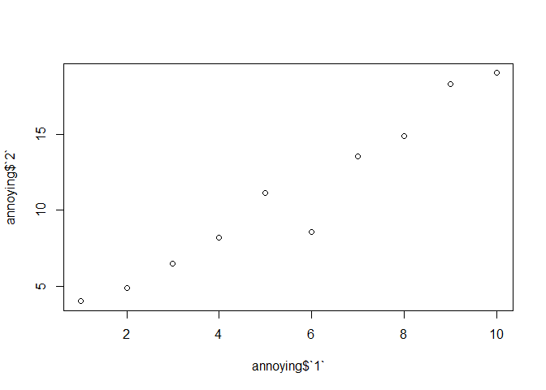
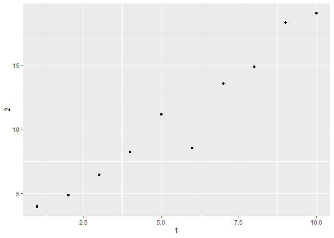

Chapter 8
================
Alyssa Counsell
April 1, 2014

Carmen’s attempt to fix troubled file
<https://r4ds.had.co.nz/tibbles.html>

``` r
library(tidyverse)
```

    ## -- Attaching packages -------------

    ## v ggplot2 3.3.1     v purrr   0.3.4
    ## v tibble  3.0.1     v dplyr   1.0.0
    ## v tidyr   1.1.0     v stringr 1.4.0
    ## v readr   1.3.1     v forcats 0.5.0

    ## Warning: package 'readr' was built under R version 4.0.2

    ## -- Conflicts ----------------------
    ## x dplyr::filter() masks stats::filter()
    ## x dplyr::lag()    masks stats::lag()

``` r
tibble(
    x = 1:5, 
    y = 1, 
    z = x ^ 2 + y
)
```

    ## # A tibble: 5 x 3
    ##       x     y     z
    ##   <int> <dbl> <dbl>
    ## 1     1     1     2
    ## 2     2     1     5
    ## 3     3     1    10
    ## 4     4     1    17
    ## 5     5     1    26

``` r
tribble(
  ~x, ~y, ~z,
  #--|--|----
  "a", 2, 3.6,
  "b", 1, 8.5
)
```

    ## # A tibble: 2 x 3
    ##   x         y     z
    ##   <chr> <dbl> <dbl>
    ## 1 a         2   3.6
    ## 2 b         1   8.5

``` r
tibble(
  a = lubridate::now() + runif(1e3) * 86400,
  b = lubridate::today() + runif(1e3) * 30,
  c = 1:1e3,
  d = runif(1e3),
  e = sample(letters, 1e3, replace = TRUE)
)
```

    ## # A tibble: 1,000 x 5
    ##    a                   b              c       d e    
    ##    <dttm>              <date>     <int>   <dbl> <chr>
    ##  1 2020-08-05 17:19:12 2020-08-06     1 0.460   f    
    ##  2 2020-08-06 00:43:51 2020-08-20     2 0.790   d    
    ##  3 2020-08-05 07:39:38 2020-08-12     3 0.953   a    
    ##  4 2020-08-05 17:27:08 2020-08-30     4 0.345   v    
    ##  5 2020-08-05 16:29:31 2020-08-18     5 0.195   l    
    ##  6 2020-08-05 11:59:52 2020-08-07     6 0.717   q    
    ##  7 2020-08-05 14:16:54 2020-08-16     7 0.00425 w    
    ##  8 2020-08-05 06:14:15 2020-08-25     8 0.217   a    
    ##  9 2020-08-05 17:36:56 2020-08-14     9 0.856   g    
    ## 10 2020-08-05 18:09:38 2020-08-12    10 0.326   c    
    ## # ... with 990 more rows

``` r
nycflights13::flights %>% 
  print(n = 10, width = Inf)
```

    ## # A tibble: 336,776 x 19
    ##     year month   day dep_time sched_dep_time dep_delay arr_time sched_arr_time
    ##    <int> <int> <int>    <int>          <int>     <dbl>    <int>          <int>
    ##  1  2013     1     1      517            515         2      830            819
    ##  2  2013     1     1      533            529         4      850            830
    ##  3  2013     1     1      542            540         2      923            850
    ##  4  2013     1     1      544            545        -1     1004           1022
    ##  5  2013     1     1      554            600        -6      812            837
    ##  6  2013     1     1      554            558        -4      740            728
    ##  7  2013     1     1      555            600        -5      913            854
    ##  8  2013     1     1      557            600        -3      709            723
    ##  9  2013     1     1      557            600        -3      838            846
    ## 10  2013     1     1      558            600        -2      753            745
    ##    arr_delay carrier flight tailnum origin dest  air_time distance  hour minute
    ##        <dbl> <chr>    <int> <chr>   <chr>  <chr>    <dbl>    <dbl> <dbl>  <dbl>
    ##  1        11 UA        1545 N14228  EWR    IAH        227     1400     5     15
    ##  2        20 UA        1714 N24211  LGA    IAH        227     1416     5     29
    ##  3        33 AA        1141 N619AA  JFK    MIA        160     1089     5     40
    ##  4       -18 B6         725 N804JB  JFK    BQN        183     1576     5     45
    ##  5       -25 DL         461 N668DN  LGA    ATL        116      762     6      0
    ##  6        12 UA        1696 N39463  EWR    ORD        150      719     5     58
    ##  7        19 B6         507 N516JB  EWR    FLL        158     1065     6      0
    ##  8       -14 EV        5708 N829AS  LGA    IAD         53      229     6      0
    ##  9        -8 B6          79 N593JB  JFK    MCO        140      944     6      0
    ## 10         8 AA         301 N3ALAA  LGA    ORD        138      733     6      0
    ##    time_hour          
    ##    <dttm>             
    ##  1 2013-01-01 05:00:00
    ##  2 2013-01-01 05:00:00
    ##  3 2013-01-01 05:00:00
    ##  4 2013-01-01 05:00:00
    ##  5 2013-01-01 06:00:00
    ##  6 2013-01-01 05:00:00
    ##  7 2013-01-01 06:00:00
    ##  8 2013-01-01 06:00:00
    ##  9 2013-01-01 06:00:00
    ## 10 2013-01-01 06:00:00
    ## # ... with 336,766 more rows

``` r
df <- tibble(
  x = runif(5),
  y = rnorm(5)
)

# extracting a vector (single variable/column)
df$x
```

    ## [1] 0.4615495 0.8477685 0.9386368 0.8015102 0.2281234

``` r
df[["x"]]
```

    ## [1] 0.4615495 0.8477685 0.9386368 0.8015102 0.2281234

``` r
df[[1]]
```

    ## [1] 0.4615495 0.8477685 0.9386368 0.8015102 0.2281234

``` r
# extracting using the pipe
df %>% .$x
```

    ## [1] 0.4615495 0.8477685 0.9386368 0.8015102 0.2281234

``` r
df %>% .[["x"]]
```

    ## [1] 0.4615495 0.8477685 0.9386368 0.8015102 0.2281234

``` r
# change to regular data frame instead of tibble
as.data.frame(df)
```

    ##           x          y
    ## 1 0.4615495 -1.8710007
    ## 2 0.8477685 -0.4317092
    ## 3 0.9386368 -0.5634188
    ## 4 0.8015102 -0.3061393
    ## 5 0.2281234  1.1987129

``` r
class(df)
```

    ## [1] "tbl_df"     "tbl"        "data.frame"

``` r
df <- as.data.frame(df)
class(df)
```

    ## [1] "data.frame"

### Exercises 10.5

1.  How can you tell if an object is a tibble? (Hint: try printing
    mtcars, which is a regular data frame).

<!-- end list -->

``` r
# You can use the str() function. mtcars is a data.frame with 32 obs and 11 variables

# diamonds (a tibble) has multiple classes:
# tbl_df, tbl, and data.frame

# If you print diamonds, before providing the first 10 rows, it says "A tibble" followed by the dimensions. Printing mtcars prints the whole dataframe and doesn't give information about it's class or structure. 
```

2.  Compare and contrast the following operations on a data.frame and
    equivalent tibble. What is different? Why might the default data
    frame behaviours cause you frustration?

<!-- end list -->

``` r
df <- data.frame(abc = 1, xyz = "a")
df$x
```

    ## [1] "a"

``` r
df[, "xyz"]
```

    ## [1] "a"

``` r
df[, c("abc", "xyz")]
```

    ##   abc xyz
    ## 1   1   a

``` r
df2<-tibble(abc = 1, xyz = "a")
df2$x
```

    ## Warning: Unknown or uninitialised column: `x`.

    ## NULL

``` r
df2[, "xyz"]
```

    ## # A tibble: 1 x 1
    ##   xyz  
    ##   <chr>
    ## 1 a

``` r
df2[, c("abc", "xyz")]
```

    ## # A tibble: 1 x 2
    ##     abc xyz  
    ##   <dbl> <chr>
    ## 1     1 a

``` r
# The dataframe takes x as a shorthand for xyz which maybe you didn't want to do. It also makes xyz a factor by automatically converting string data into a factor.
# 
# the tibble throws an error for df$x and preserves the character vector instead of converting to factor.
```

3.  If you have the name of a variable stored in an object, e.g. var \<-
    “mpg”, how can you extract the reference variable from a tibble?
4.  Practice referring to non-syntactic names in the following data
    frame by:

<!-- end list -->

``` r
annoying <- tibble(
  `1` = 1:10,
  `2` = `1` * 2 + rnorm(length(`1`))
)

# 1
annoying$`1`
```

    ##  [1]  1  2  3  4  5  6  7  8  9 10

``` r
#2
plot(annoying$`1`, annoying$`2`)
```

<!-- -->

``` r
ggplot(annoying, aes(x=`1`, y=`2`))+geom_point()
```

<!-- -->

``` r
#3
annoying2<-mutate(annoying,
                  `3`=`1`/`2`)

annoying3<-rename(annoying2,
    three=`3`, one=`1`, two=`2`)


# * Extracting the variable called 1.
# 
# * Plotting a scatterplot of 1 vs 2.
# 
# * Creating a new column called 3 which is 2 divided by 1.
# 
# * Renaming the columns to one, two and three.
```

5.  What does tibble::enframe() do? When might you use it?

<!-- end list -->

``` r
tibble::enframe(c(a = 5, b = 4))
```

    ## # A tibble: 2 x 2
    ##   name  value
    ##   <chr> <dbl>
    ## 1 a         5
    ## 2 b         4

``` r
tibble::enframe(c(a = 5, b = c(4,7)))
```

    ## # A tibble: 3 x 2
    ##   name  value
    ##   <chr> <dbl>
    ## 1 a         5
    ## 2 b1        4
    ## 3 b2        7

``` r
tibble::enframe(list(one = 1, two = 2:3, three = 4:6))
```

    ## # A tibble: 3 x 2
    ##   name  value    
    ##   <chr> <list>   
    ## 1 one   <dbl [1]>
    ## 2 two   <int [2]>
    ## 3 three <int [3]>

``` r
# provides a tibble with the name of the variable as the column variable and the value in a new variable. If a list the value would correspond to the list.
```

6.  What option controls how many additional column names are printed at
    the footer of a tibble?

<!-- end list -->

``` r
# n_extra argument in print function on a tibble

package?tibble
```

    ## starting httpd help server ... done

``` r
?print.tbl

print(nycflights13::flights, n_extra=5)
```

    ## # A tibble: 336,776 x 19
    ##     year month   day dep_time sched_dep_time dep_delay arr_time sched_arr_time
    ##    <int> <int> <int>    <int>          <int>     <dbl>    <int>          <int>
    ##  1  2013     1     1      517            515         2      830            819
    ##  2  2013     1     1      533            529         4      850            830
    ##  3  2013     1     1      542            540         2      923            850
    ##  4  2013     1     1      544            545        -1     1004           1022
    ##  5  2013     1     1      554            600        -6      812            837
    ##  6  2013     1     1      554            558        -4      740            728
    ##  7  2013     1     1      555            600        -5      913            854
    ##  8  2013     1     1      557            600        -3      709            723
    ##  9  2013     1     1      557            600        -3      838            846
    ## 10  2013     1     1      558            600        -2      753            745
    ## # ... with 336,766 more rows, and 11 more variables: arr_delay <dbl>,
    ## #   carrier <chr>, flight <int>, tailnum <chr>, origin <chr>, ...
